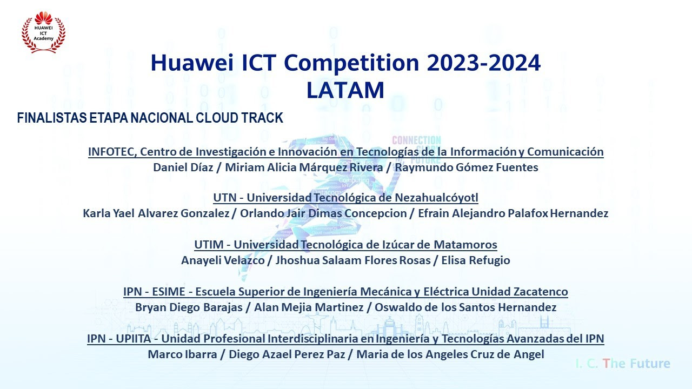

# 👋 ¡Hola! Soy Jhoshua Salaam Flores Rosas

### 👨‍💻 Ingeniero en Desarrollo y Gestión de Software Multiplataforma

---

🎯 _Apasionado por el orden y la creación de soluciones limpias y eficientes._

---

## 🧰 Tecnologías y herramientas con las que he trabajado

- **Frontend:** Next.js · React Native · HTML · CSS · JavaScript · TypeScript · XML  
- **Backend:** NestJS · C# · Blazor  
- **Otras herramientas:** Git · Visual Studio Code · Postman · Swagger · Docker

---

## 🏅 Certificados y reconocimientos

A continuación se muestra una galería visual de algunos de mis certificados.  

| Certificado | Imagen |
|------------|--------|
| Certificado 1 |  |
| Certificado 2 |  |
| Certificado 3 |  |
| Certificado 4 |  |
| Certificado 5 |  |
| Reconocimiento |  |

---

¡Gracias por visitar mi perfil!
